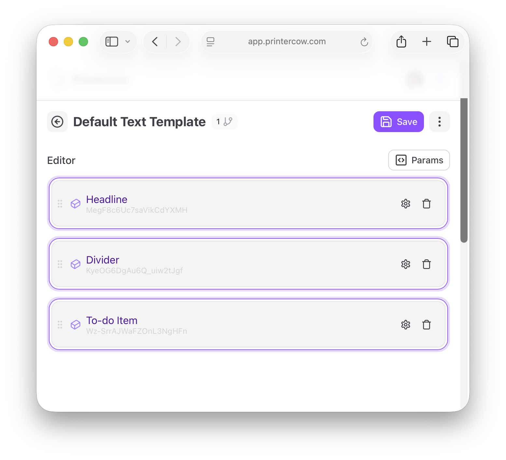

# LocalKuh

A simple web application that converts markdown task lists into physical prints using [PrinterCow](https://www.printercow.com).

## What it does

LocalKuh takes markdown content with task lists (checkboxes) and sends them to your PrinterCow printer. It filters out everything except markdown task items like:

```markdown
- [ ] Buy groceries
- [x] Walk the dog
- [ ] Finish project
```

The printed output includes a header and formats your tasks as a clean todo list.

I use it paired with Obsidian and the plugin "Post Webhook" that takes everything from a daily note and filters out _just_ the tasksmarkdown lists.

## Setup Instructions

### Prerequisites

- Docker and Docker Compose (or the wonderful orbstack!) installed
- A [PrinterCow](https://www.printercow.com) account, receipt printer, and API key

### Quick Start

1. **Clone or download this repository**

2. **Set your PrinterCow API key**
   
   Create a `.env` file in the project directory:
   ```bash
   cp .env.example .env
   ```
   
   Edit `.env` and add your actual API key:
   ```
   API_KEY=your_actual_printercow_api_key_here
   ```

3. **Modify a template to support this service**



Next, grab the appropriate UUIDs from Headline and To-Do Item so the api sends the correct content from your markdown.

4. **Start the application**
   ```bash
   docker-compose up -d
   ```

5. **Access the web interface**
   
   Open your browser to `http://localhost:3000`

6. **Send a print job**
   
   Paste your markdown content with tasks and click print!

### Alternative: Set API key inline

You can also set the API key directly when starting:

```bash
API_KEY=your_actual_api_key docker-compose up -d
```

## Usage

1. Open `http://localhost:3000` in your browser
2. Paste markdown content containing tasks (- [ ] items)
3. Click the print button
4. Your PrinterCow printer will receive the formatted todo list

## Usage with Obsidian

1. Install the [obsidian://show-plugin?id=post-webhook](Post Webhook) plugin
2. Enter the URL this application is running: `http://localhost:3000/print`
3. Activate Webhook (Command-Shift-P, `printercow` for me)

## Stopping the Application

```bash
docker-compose down
```

## Credits

This project is powered by [PrinterCow](https://www.printercow.com) - the service that makes it possible to print from anywhere to physical receipt printers via API.